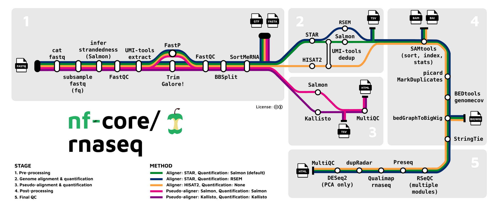

## RNA-seq Analysis using nf-core/rnaseq

This repository contains a pipeline for RNA-seq analysis using the `nf-core/rnaseq` workflow. The pipeline is designed to be run using Nextflow and Docker/Singularity, ensuring reproducibility and ease of use. 

<p float="left">
  
</p>


The nf-core/rnaseq pipeline is a bioinformatics tool designed for the analysis of RNA sequencing data from organisms with an available reference genome and annotation. It processes a samplesheet and FASTQ files, conducting quality control (QC), trimming, and (pseudo-)alignment. The pipeline outputs a gene expression matrix along with a comprehensive QC report. This RNA-seq analysis pipeline employs STAR, RSEM, HISAT2, or Salmon for generating gene and isoform counts, as well as performing thorough quality control checks.


## Project Structure

```
📦Nextflow-RNA_Sequencing_Pipeline
 ┣ 📂conf
 ┃ ┣ 📜base.config
 ┃ ┣ 📜igenomes.config
 ┃ ┗ 📜modules.config
 ┣ 📂data
 ┃ ┣ 📜Drosophila_melanogaster.BDGP6.85.sample.gtf
 ┃ ┣ 📜Drosophila_melanogaster.BDGP6.88.sample.cdna.fa
 ┃ ┣ 📜mut_lib1_R1.fq.gz
 ┃ ┣ 📜mut_lib1_R2.fq.gz
 ┃ ┣ 📜mut_lib2_R1.fq.gz
 ┃ ┣ 📜mut_lib2_R2.fq.gz
 ┃ ┣ 📜WT_lib1_R1.fq.gz
 ┃ ┣ 📜WT_lib1_R2.fq.gz
 ┃ ┣ 📜WT_lib2_R1.fq.gz
 ┃ ┗ 📜WT_lib2_R2.fq.gz
 ┣ 📂docs
 ┃ ┗ 📂images
 ┣ 📂results
 ┃ ┣ 📂fastqc
 ┃ ┣ 📂multiqc
 ┃ ┣ 📂pipeline_info
 ┃ ┣ 📂star_salmon
 ┃ ┗ 📂trimgalore
 ┣ 📂scripts
 ┃ ┗ 📜samplesheet.csv
 ┣ 📜.nextflow.log
 ┣ 📜custom.config
 ┗ 📜README.md

 ```


## Data

The data used consists of a small selection of Drosophila melanogaster genes, including sequencing reads and gene annotations. The RNA-seq dataset can be accessed at [Zenodo](https://doi.org/10.5281/zenodo.1193466). 


## Methods
Data was processed using [nf-core/rnaseq v3.14.0](https://doi.org/10.5281/zenodo.1400710) of the nf-core collection of workflows (Ewels et al., 2020), utilising reproducible software environments from the Bioconda (Grüning et al., 2018) and Biocontainers (da Veiga Leprevost et al., 2017) projects.

The pipeline was executed with Nextflow v24.04.2 (Di Tommaso et al., 2017) with the following command:

```
nextflow run nf-core/rnaseq --input scripts/samplesheet.csv --outdir results --genome BDGP6 -profile docker -c custom.config
```

## Steps

1. **Dependency Installation**

    First, install Nextflow. All nf-core pipelines use Nextflow, so this must be installed on the system where you launch your analysis. Detailed instructions can be found here [Nextflow Installation](https://nf-co.re/docs/usage/getting_started/installation).

    For Gitpod, install Nextflow in the terminal with the following command (this may differ for Windows or macOS):

    ```
    wget -qO- https://get.nextflow.io | bash
    ```

    Then, move it to the appropriate directory or path using:

    ```
    export PATH=YOUR-WORKSPACE-PATH:$PATH
    ```
    This command adds the Nextflow binary to your system's PATH so it can be executed from any directory.


2. **Test your Setup**

    Testing your Nextflow setup with `-profile test` ensures correct configuration, early issue detection, resource efficiency, reproducibility, and confidence for smooth and effective data analysis

    Execute `nf-core/rnaseq` using the test and docker profiles:

    ```
    nextflow run nf-core/rnaseq -profile test,docker --outdir results
    ```

    * `nextflow run nf-core/rnaseq`: Runs the nf-core RNA-seq workflow.
    * `-profile test,docker`: Uses the test profile to run a small test dataset and the docker profile to use Docker containers for reproducibility.
    * `--outdir results`: Specifies the directory where output files will be saved.


3. **Create a Samplesheet Input**

    Create a samplesheet with information about the samples you would like to analyze before running the pipeline. This should be a comma-separated file with 4 columns and a header row: 

    | Column        | Description                                                                                                                         |
    |---------------|-------------------------------------------------------------------------------------------------------------------------------------|
    | sample        | Custom sample name. This entry will be identical for multiple sequencing libraries/runs from the same sample. Spaces in sample names are automatically converted to underscores (_). |
    | fastq_1       | Full path to FastQ file for Illumina short reads 1. File must be gzipped with the extension ".fastq.gz" or ".fq.gz".                  |
    | fastq_2       | Full path to FastQ file for Illumina short reads 2. File must be gzipped with the extension ".fastq.gz" or ".fq.gz".                  |
    | strandedness  | Sample strand-specificity. Must be one of unstranded, forward, reverse, or auto.                                                     |


4. **Custom Nextflow Configuration File**

    The pipeline provides a default nextflow.config file. To perform RNA sequencing with your own data, modify nextflow.config to match your available resources, the dataset you will analyze, and the necessary dependencies. Detailed configuration instructions can be found here
    [custom configuration files](https://nf-co.re/usage/configuration#custom-configuration-files).


5.  **Run the Pipeline**

    Now, we run the pipeline using 

    ```
    nextflow run nf-core/rnaseq --input scripts/samplesheet.csv --outdir results --genome BDGP6 -profile docker -c custom.config
    ```

    * `--input scripts/samplesheet.csv`: Specifies the path to your samplesheet.
    * `--outdir results`: Specifies the directory where output files will be saved.
    * `--genome BDGP6`: Specifies the genome to use for alignment and analysis.
    * `-profile docker`: Uses Docker containers for reproducibility.
    * `-c custom.config`: Uses a custom configuration file.

    Upon successful completion, the output will display a success message like this:

    <p float="left">
    
    </p>

    This output indicates that the pipeline ran successfully, detailing the duration, CPU hours, and the tasks that were completed successfully.

## Results

The results directory provides a structured output of the pipeline, encompassing initial quality checks, trimming, alignment, quantification, and comprehensive QC reporting. Each subdirectory is dedicated to a specific stage of the pipeline, ensuring clarity and organization of the analysis outputs.

### **Directory Structure**

```
....
┣ 📂results
 ┃ ┣ 📂fastqc
 ┃ ┣ 📂multiqc
 ┃ ┣ 📂pipeline_info
 ┃ ┣ 📂star_salmon
 ┃ ┗ 📂trimgalore
....
```

### **📂 fastqc**

The fastqc directory contains the results of the initial quality control checks performed on the raw FASTQ files using FastQC. Each sample will have a corresponding HTML file and a ZIP file containing detailed QC metrics.

* HTML files: Interactive reports summarizing the quality of the raw sequence data.
* ZIP files: Compressed files containing the raw QC metrics and plots used by FastQC.

### **📂 multiqc**

The multiqc directory houses the aggregated quality control report generated by MultiQC. MultiQC compiles and summarizes the QC results from FastQC (and other tools if used) into a single report for easier interpretation.

* multiqc_report.html: The main HTML report providing an overview of all QC metrics across samples.
* multiqc_data: Directory with additional data files used to generate the MultiQC report.


### **📂 pipeline_info**

The pipeline_info directory includes various log and configuration files related to the execution of the pipeline. This information is crucial for troubleshooting and ensuring reproducibility.

* execution_report.html: A report detailing the execution of the pipeline.
* trace.txt: A trace file with detailed execution statistics for each process.
* config files: Copies of the configuration files used for the pipeline run.
* logs: Log files capturing the output and errors for each step of the pipeline.


### **📂 star_salmon**

The star_salmon directory contains the outputs from the alignment and quantification steps, typically performed by STAR for alignment and Salmon for quantification. This directory may include:

* BAM files: Aligned reads in BAM format.
Quantification files: Files containing gene and isoform expression levels.
* Log files: Logs from STAR and Salmon capturing the details of the alignment and quantification processes.

### **📂 trimgalore**

The trimgalore directory includes the results from the trimming step carried out by Trim Galore. This step removes low-quality bases and adapter sequences from the raw reads.

* FASTQ files: Trimmed FASTQ files ready for subsequent analysis steps.
* Log files: Logs detailing the trimming process and statistics.


## References
* Di Tommaso, P., Chatzou, M., Floden, E. W., Barja, P. P., Palumbo, E., & Notredame, C. (2017). Nextflow enables reproducible computational workflows. Nature Biotechnology, 35(4), 316-319. doi: 10.1038/nbt.3820
* Ewels, P. A., Peltzer, A., Fillinger, S., Patel, H., Alneberg, J., Wilm, A., Garcia, M. U., Di Tommaso, P., & Nahnsen, S. (2020). The nf-core framework for community-curated bioinformatics pipelines. Nature Biotechnology, 38(3), 276-278. doi: 10.1038/s41587-020-0439-x
* Grüning, B., Dale, R., Sjödin, A., Chapman, B. A., Rowe, J., Tomkins-Tinch, C. H., Valieris, R., Köster, J., & Bioconda Team. (2018). Bioconda: sustainable and comprehensive software distribution for the life sciences. Nature Methods, 15(7), 475–476. doi: 10.1038/s41592-018-0046-7
* da Veiga Leprevost, F., Grüning, B. A., Alves Aflitos, S., Röst, H. L., Uszkoreit, J., Barsnes, H., Vaudel, M., Moreno, P., Gatto, L., Weber, J., Bai, M., Jimenez, R. C., Sachsenberg, T., Pfeuffer, J., Vera Alvarez, R., Griss, J., Nesvizhskii, A. I., & Perez-Riverol, Y. (2017). BioContainers: an open-source and community-driven framework for software standardization. Bioinformatics (Oxford, England), 33(16), 2580–2582. doi: 10.1093/bioinformatics/btx192
